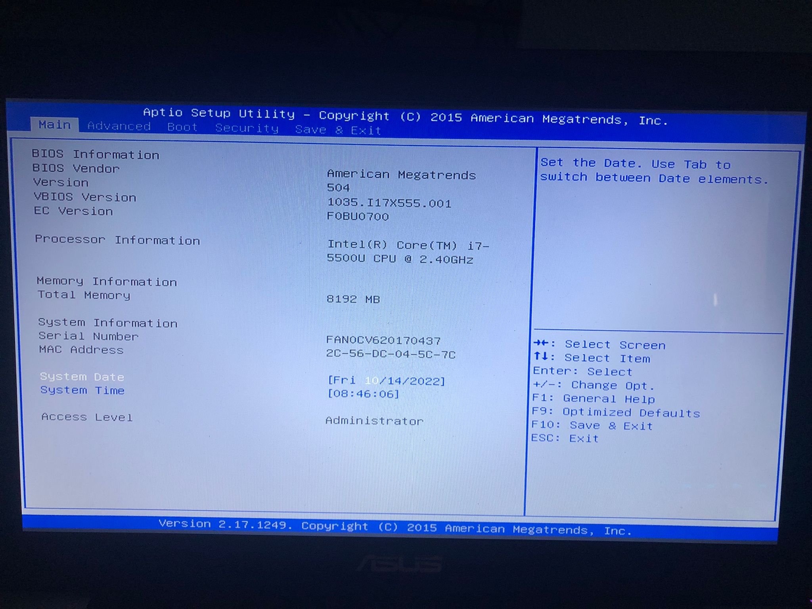
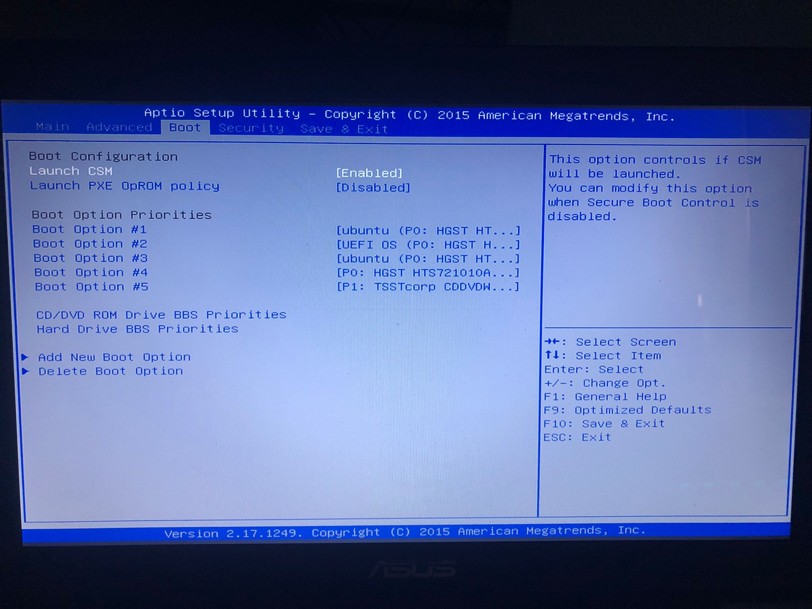

author: Grupo 4
summary: Resumen del CodeLab
id: BRS-proyecto-2.0
categories: codelab,markdown
environments: Web
status: Published
feedback link: Un enlace en el que los usuarios puedan darte feedback (quizás creando un issue en un repositorio de git)
analytics account: ID de Google Analytics

# Proyecto 2.0: Segmentación de una red.

## Introducción

Segmentar una red es una de las medidas más básicas de seguridad que podemos llevar a cabo en una infraestructura, ya no solo por incrementar su seguridad sino también por su rendimiento y posibilidad de gestión.

Como organización, definiremos unos criterios para dividir los equipos de nuestra red. En nuestro caso hemos optado por una división en función de la funcionalidad para así facilitar que los departamentos se comuniquen y compartan recursos entre sí.

Como hemos optado por una división por funcionalidad realizaremos la división mediante VLSM para así asignar VLANs a los diferentes departamentos de nuestra empresa.

## Definición de redes locales virtuales (VLANs)

TextoTextoTexto

## Cálculo de los direccionamientos de cada VLAN

Mediante VLSM...

## Configuración de VLANs en Switches

TextoTextoTexto

## Configuración de Router mediante método router-on-stick

TextoTextoTexto

### Métodos más comunes para modificar la BIOS

Algunos de los métodos más comunes para modificar/resetear configuraciones de la BIOS son:

Negative
: Uso de contraseñas maestras que tienen algunos fabricantes.

Negative
: Quitar la pila de botón que tiene nuestra placa para borrar la configuración previa de la BIOS.

Negative
: Hacer un cortocircuito en determinador pines de la placa para el borrado de la configuración de la BIOS.

Negative
: Algunas placas disponen de un botón físico para el renicio de la configuración de la BIOS.

### Maximizar la seguridad

Para intentar maximizar la seguridad de nuestro dispositivo y permitir el mínimo acceso a la BIOS, entre otras opciones, tendremos en cuenta las siguientes acciones.

Positive
: Cifrar los discos duros de nuestro ordenador.

Positive
: Evitar contraseñas genéricas o faciles de adivinar.

Positive
: Configurar, si se puede, la placa para evitar resets de contraseñas.

Positive
: Proteger físicamente el acceso mediante carcasas de seguridad con llave.
