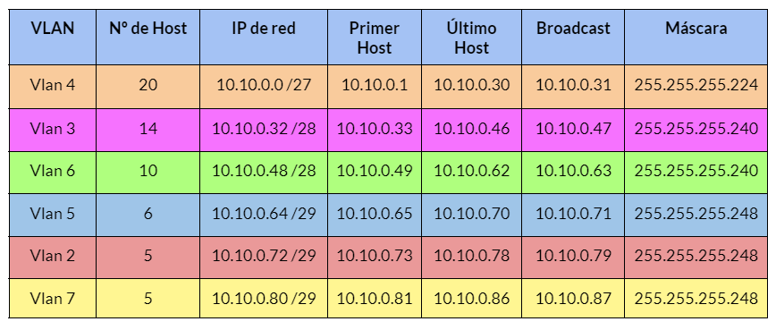
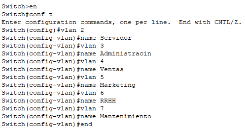
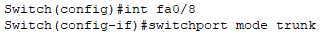
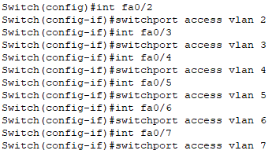
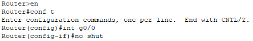
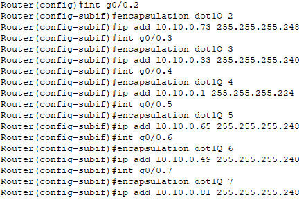
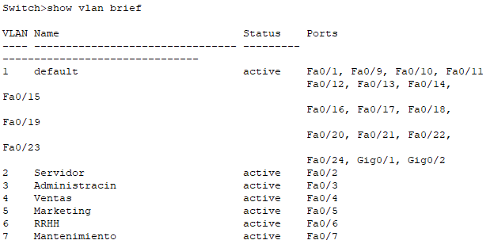
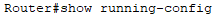
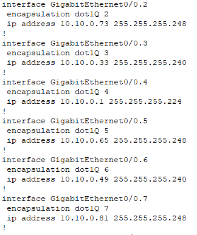

author: Grupo 4
summary: Resumen del CodeLab
id: BRS-proyecto-2.0
categories: codelab,markdown
environments: Web
status: Published
feedback link: Un enlace en el que los usuarios puedan darte feedback (quizás creando un issue en un repositorio de git)
analytics account: ID de Google Analytics

# Proyecto 2.0: Segmentación de una red.

## Introducción

FOTITO

Segmentar una red es una de las medidas más básicas de seguridad que podemos llevar a cabo en una infraestructura, ya no solo por incrementar su seguridad sino también por su rendimiento y posibilidad de gestión.

Como organización, definiremos unos criterios para dividir los equipos de nuestra red. En nuestro caso hemos optado por una división en función de la funcionalidad para así facilitar que los departamentos se comuniquen y compartan recursos entre sí.

Como hemos optado por una división por funcionalidad realizaremos la división mediante VLSM para así asignar VLANs a los diferentes departamentos de nuestra empresa.

## Definición de redes locales virtuales (VLANs)

FOTITO

Tras un estudio sobre los departamentos que posee nuestra empresa actualmente se han definido las siguientes redes locales virtuales:

### VLANs

Positive
: VLAN 2 para los servidores de los diferentes servicios.

Positive
: VLAN 3 para el departamento de Administración.

Positive
: VLAN 4 para el departamento de Ventas.

Positive
: VLAN 5 para el departamento de Marketing.

Positive
: VLAN 6 para el departamento de RRHH.

Positive
: VLAN 7 para el departamento de Mantenimiento.

## Cálculo de los direccionamientos de cada VLAN

Mediante VLSM hemos realizado el direccionamiento de cada VLAN y hemos obtenido el siguiente resultado:

FOTITO

## Configuración de VLANs en Switches

Para la creación y configuración de las diferentes VLANs nos dirigiremos a nuestro Switch, o varios Switches, y por introducir los siguientes comandos:

FOTITO

Una vez creadas las diferentes VLANs continuaremos con la configuración de cada una de las interfaces comenzando por aquella que este conectada a nuestro router configurandolo en modo trunk, en caso de que hubiera otro switch este tambien se configuraría en modo trunk.

FOTITO

A continuación configuraremos las interfaces que vayan hacia los equipos de las diferentes VLANs en modo access de la siguiente manera:

FOTITO

## Configuración de Router mediante método router-on-stick

FOTITO

Una vez configurado el switch, o los switches en el caso de que tengamos más de uno, pasaremos a configurar nuestro router mediante el método router-on-stick de la siguiente manera:

